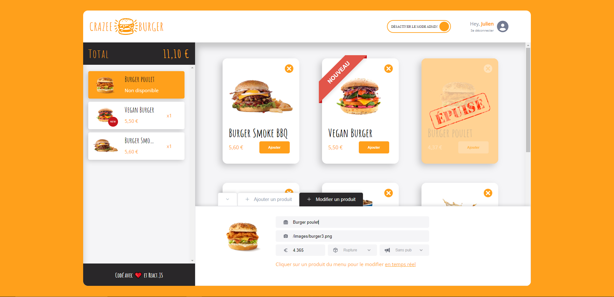

# Crazee-burger with REACT !

Projet Frond End React - Formation Videv.  
Création d'une application web de vente de burger Crazee burger!

## INTRODUCTION

Je suis actuellement en reconversion professionnelle avec pour objectif de devenir développeur React junior. Ma formation a été soigneusement conçue autour d'un projet visant à me rendre opérationnel et prêt à travailler dans le domaine du développement web.  

Cette formation s'inscrit dans une approche pragmatique, mettant l'accent sur le travail concret et la simulation d'un environnement professionnel. Grâce à des projets pratiques et des scénarios basés sur des situations réelles en entreprise, j'ai acquis des compétences approfondies dans le développement frontend avec React.  

Projet réalisé au sein de la formation d'un lead dev senior Vi https://linktr.ee/videv 

  

## Global Projet Feature

- **Enregistrement** et **sauvegarde** de chaque nouvel utilisateur et de son menu associé.
- **Sauvegarde** du panier de chaque utilisateur.
- Installation d'un mode admin avec les **fonctionnalités** suivantes :
  + **Ajout** d'un produit avec les choix suivants : _titre_, _image_ (image url), _prix_, _pub_, _stock_
  + **Modification en _temp reel_** des produits déjà existants 
  + **Synchronisation** constante des produits du panier et des produits du menu
- **Animation** pour les différentes manipulations de l'utilisateur.

## TECHNIQUE

### JAVASCRIPT (React), CSS, HTML : 

- Introduction et utilisation de _**styled-component**_.

- Création et utilisation de **composants réutilisables**.

- Utilisation des ***custom Hooks*** et des différents ***hooks*** de base : _useEffect_, _useContext_, _useNavigate_, _useRef_.

- ***React Transition Group/CSSTransition/keyframe*** pour travailler les animations efficacement sur le cycle de vie d'un composant React.

### Clean code and best practice

- Importance du _clean code_ et des _best practise_ dans l'**organisation**, **gestion des bugs** et **implémentation de nouvelles fonctionnalités** dans un projet sur le long terme.

- Organisation **claire et ordonnée** du dossier du projet comme souvent utilisé en entreprise. Exemple _enums_, _utils_, _theme_, _assets_, _api_, etc

### Github

- Utilisation et introduction à différentes fonctionnalités de GitHub pour une organisation d'un projet efficace : _push_, _pull_, _rebase_, _commit_, _stash_, _reset_, etc

- Introduction à l'organisation de Git en entreprise.

### BDD Firebase / local storage CRUD:

- ***Ajout*** et ***sauvegarde*** de chaque nouvel utilisateur avec son propre menu associé à l'aide de ***Firestore Database***.

- ***Sauvegarde***  du panier de chaque utilisateur dans le **Local Storage**.

### FIGMA :

- Projet assisté d'une maquette ***Figma*** pour les différentes ***prise de mesure*** et de couleurs nécessaires à la ***reproduction*** de la maquette.

### TRELLO - Outil Gestion de Projet 

 - Reproduction d'un cas d'utilisation classique de TRELLO et d'autres outils de gestion de projet : _TODO_, _DOING_, _TO TEST_, _DONE_

### Méthode Agile SCRUM : Organisation comme en Entreprise

- Introduction à la méthode SCRUM : _Sprint Planning_ , _Daily Scrum_, _Sprint Review_, _Sprint Retrospective_